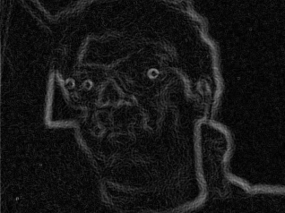

# Arty A7 streaming Sobel accelerator

This project is a complete FPGA camera-processing path for the Digilent Arty
A7-100T (`xc7a100tcsg324-1`):

```text
OV7670 camera -> RGB565 capture -> grayscale -> FPGA Sobel accelerator
              -> validated UDP packets -> laptop capture/live display
```

The accelerator is the 100 MHz streaming Sobel datapath in `rtl/conv/`. It
uses BRAM line buffers, forms a 3x3 window, and accepts one valid pixel per
clock once the pipeline is full. Camera control and Ethernet are the input and
output plumbing around that compute core.

## Current status

| Milestone | Result |
|---|---|
| M1 board reset, LEDs, UART | Complete, hardware tested |
| M2 one-pixel-per-clock Sobel core | Complete, simulated and hardware tested |
| M3 physical OV7670 capture | Complete, 306-frame hardware run |
| M4 100 Mb/s Ethernet, ARP, UDP echo | Complete, 10,000-echo hardware run |
| M5 camera/Sobel over UDP | Complete, 216 consecutive reconstructed frames |
| M6 live laptop viewer and OpenCV benchmark | Complete, 300-frame display and final physical benchmark passed |
| M7 optimized application/dashboard | Planned: beat equivalent OpenCV, raise FPS, refine edges, and add a Streamlit activity-monitor dashboard |

The tested M5 bitstream also preserves M4 UDP echo on port 4000. M6 reuses the
same bitstream: it adds laptop display and measurement, not a new FPGA data
path.

## Hardware and network setup

Required hardware:

- Arty A7-100T
- direct-DVP OV7670 module wired as documented in
  `docs/milestone3_camera_hardware_contract.md`
- USB cable for programming/UART
- Ethernet cable and the ASIX adapter used during validation

Configure the Windows adapter named `Ethernet 2`:

```text
IPv4 address: 192.168.10.1
Subnet mask:  255.255.255.0
Gateway:      blank
FPGA address: 192.168.10.2
FPGA MAC:     02:00:00:00:00:01
```

Program this bitstream in Vivado Hardware Manager:

```text
vivado_project_m5/arty_conv_m5.runs/impl_1/arty_m5_camera_ethernet_top.bit
```

Tested SHA-256:

```text
8c9577a1ff240642bf1aef7a37178feb910d6b0b2e218a7052d94dc535e7bc00
```

Board controls for the integrated image:

| Control | Function |
|---|---|
| `BTN0` | complete reset |
| `BTN1` | restart camera initialization and PHY discovery |
| `BTN2` | clear sticky errors and counters |
| `BTN3` | print a coherent M5 UART status line |
| `SW0` | select OV7670 color bars on the next initialization |
| `SW1` | force grayscale; leave at `0` for host-selected mode |
| `SW2` | local stream enable; set to `1` |
| `LD4` | heartbeat |
| `LD5` | camera configured and Ethernet linked |
| `LD6` | packet activity |
| `LD7` | sticky error |

After programming, set `SW1=0`, `SW2=1`, choose `SW0`, press `BTN1`, and wait
for `LD5`. Use color bars (`SW0=1`) for deterministic testing and the live lens
(`SW0=0`) for normal viewing.

## Host setup

The proven PGM receiver uses only the Python standard library. The M6 viewer
and benchmark require NumPy and desktop OpenCV:

```powershell
py -3 -m pip install -r scripts/python/requirements-m6.txt
```

`pyserial` is needed only for the UART monitor, and Scapy/Npcap is needed only
for raw Ethernet diagnostics.

## Run the project

Run commands below from the repository root.

First verify that the integrated bitstream still answers M4 UDP echo:

```powershell
py -3 scripts/python/ethernet_test.py udp --count 1 --timeout 2
```

Save one validated FPGA Sobel frame as a PGM:

```powershell
py -3 scripts/python/camera_udp_receiver.py --frames 1 --stream sobel --timeout 10
```

Saved frames appear under `docs/m5_frames/`. That generated directory is
ignored by Git.

Display the continuous FPGA Sobel stream on the laptop:

```powershell
py -3 scripts/python/camera_udp_viewer.py --stream sobel
```

Viewer keys:

- `Q` or `Esc`: stop and send the FPGA STOP command
- `S`: save the current validated frame under `docs/m6_snapshots/`

Display the grayscale diagnostic stream:

```powershell
py -3 scripts/python/camera_udp_viewer.py --stream gray
```

## Captured laptop output

These are lossless PNG copies of frames saved from the live viewer with `S`.
The grayscale image is the camera stream sent to the laptop; the Sobel image
was computed in the FPGA before transmission.

| Grayscale diagnostic stream | FPGA Sobel stream |
|---|---|
|  |  |

If port 4001 times out, confirm that Hardware Manager programmed the M5
bitstream rather than the M4 image, run the one-packet UDP echo to populate
ARP, verify `SW2=1`, and press `BTN3` for the UART status line.

## Benchmark FPGA and OpenCV

Measure the laptop OpenCV kernel without hardware:

```powershell
py -3 scripts/python/benchmark_m6_opencv.py --cpu-only --cpu-samples 1000
```

Run the complete physical comparison (300 FPGA Sobel frames followed by 300
grayscale frames processed by OpenCV):

```powershell
py -3 scripts/python/benchmark_m6_opencv.py --frames 300
```

Results are written to:

```text
docs/m6_benchmark_results.json
docs/m6_benchmark_results.csv
```

The benchmark reports three different quantities:

1. measured OpenCV CPU kernel time;
2. measured end-to-end frame rate for FPGA and CPU paths;
3. the FPGA core's labeled throughput estimate from one pixel/clock at 100 MHz.

The estimate is not presented as camera FPS. Optimized OpenCV may beat this
small FPGA core on a modern laptop; the result should report that honestly.

The final controlled 1,000-sample OpenCV run measured 0.629 ms mean, 0.504 ms
median, and 1.116 ms p95. The final physical FPGA and CPU paths both measured
7.503 FPS with zero packet/frame integrity errors, proving that the current
camera path, not Sobel compute, limits end-to-end frame rate.

## Why the current stream is 7.5 FPS

The viewer does not cap or sleep the stream at 7.5 FPS. The FPGA Sobel and
grayscale modes both receive a new frame every approximately 133.3 ms because
that is the cadence produced by the current OV7670 initialization profile.

The bitstream supplies a 24 MHz camera `XCLK`, then programs the conservative
QVGA timing values in `rtl/camera/camera_register_init.sv`: `CLKRC=0x01`,
`COM3=0x04`, `COM14=0x19`, downsample control `0x72=0x11`, and pixel-clock
scaling `0x73=0xF1`. The extra downsample and pixel-clock scaling configuration
is the leading cause of the observed four-to-one reduction from the sensor's
nominal 30 FPS mode. That diagnosis is consistent with the identical 7.503 FPS
cadence in both stream modes and the absence of scheduler/FIFO drops; the exact
contribution of each sensor divider still needs a change-and-measure hardware
test. The conservative profile was retained because it produced stable,
error-free initial bring-up.

This is not the project's theoretical limit:

- the Sobel core accepts one pixel per 100 MHz clock after pipeline fill;
- one 320x240 frame represents only 0.768 ms of active core work;
- a 30 FPS one-byte-per-pixel stream is about 18.4 Mb/s before packet
  overhead, comfortably below 100 Mb/s Ethernet;
- the measured OpenCV kernel also has ample capacity at 0.629 ms mean.

Increasing the rate requires a new FPGA build because the camera register
table is compiled into RTL. The safe next step is to remove one sensor clock
divider at a time, validate approximately 15 FPS and then 30 FPS, and rerun
the camera, FIFO, UDP integrity, and image-quality regressions. The present M6
result remains the verified stable profile; higher-rate settings are not yet
hardware-qualified.

## Build and verify the M5 FPGA image

Open a Vivado command prompt, then run from `scripts/`:

```powershell
$env:XILINX_LOCAL_USER_DATA = "NO"
vivado -mode batch -source run_m5_simulations.tcl -notrace
vivado -mode batch -source check_m5_synthesis.tcl -notrace
vivado -mode batch -source build_m5_bitstream.tcl -notrace
```

The four M5 simulations cover the control session, non-preemptive TX
scheduler, complete 74-packet Sobel frame, and integrated Sobel/FIFO/UDP path.
The routed build passes timing at WNS `0.634 ns` and WHS `0.036 ns`.

Check the dependency-free M6 protocol client with:

```powershell
py -3 scripts/python/test_m6_stream_client.py
py -3 scripts/python/test_m6_opencv.py
```

Historical M3/M4 build and regression scripts remain under `scripts/` for
fault isolation.

## What the protocol carries

- UDP port 4000: preserved M4 echo service
- UDP port 4001: M5/M6 START, STOP, PING, ACK, and image stream
- Sobel frame: 318x238, 75,684 bytes, 74 datagrams
- Grayscale frame: 320x240, 76,800 bytes, 75 datagrams
- Maximum image payload: 1,024 bytes per datagram
- Integrity: frame/packet sequence, offsets, lengths, flags, and CRC-32

See `docs/milestone5_camera_ethernet_contract.md` for the byte-exact format.

## Main repository paths

```text
rtl/conv/          streaming grayscale/Sobel accelerator
rtl/camera/        OV7670 clock, SCCB, DVP capture, and CDC
rtl/ethernet/      DP83848/MII, Ethernet frames, ARP, and UDP echo
rtl/integration/   M5 session, stream FIFO, packetizer, and scheduler
rtl/top/           milestone top-level designs
sim/               self-checking RTL tests and device models
scripts/           Vivado build/regression scripts
scripts/python/    capture, viewer, benchmark, UART, and diagnostic tools
docs/              contracts, evidence, handoffs, and reports
```

## Handoff documents

- M5 protocol: `docs/milestone5_camera_ethernet_contract.md`
- M5 implementation: `docs/milestone5_camera_ethernet_logic_walkthrough.md`
- M5 physical result: `docs/milestone5_hardware_validation.md`
- M5 completion and M6 plan:
  `docs/milestone5_handoff_and_milestone6_plan.md`
- final M6 viewer/benchmark result: `docs/milestone6_benchmark_results.md`
- M6 handoff and detailed M7 plan:
  `docs/milestone6_handoff_and_milestone7_plan.md`

The M6 plan defines live-view acceptance, exact OpenCV equivalence, benchmark
methodology, result files, and the distinction between compute throughput and
end-to-end performance.
