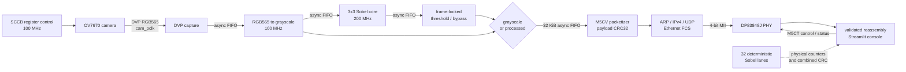

# Arty A7 real-time vision accelerator

An end-to-end, CPU-free FPGA vision path for the Digilent Arty A7-100T. Custom
SystemVerilog configures and captures an OV7670, converts RGB565 to grayscale,
computes Sobel edges, packetizes validated pixels as UDP, and streams them to a
Python/Streamlit operator console.

**Final result:** a physically measured 32-lane Sobel benchmark reaches
**81,380 frames/s**, **5.739x** the controlled single-thread OpenCV throughput,
with a bit-exact output CRC.

<p align="center">
  
  
</p>

## At a glance

| | |
|---|---|
| Target | Digilent Arty A7-100T, Artix-7 `xc7a100tcsg324-1` |
| Sensor | OV7670, direct 8-bit DVP RGB565, QVGA |
| Live modes | 320x240 grayscale; 318x238 Sobel; binary-thresholded Sobel |
| Live rate | Qualified at 7.5, 15, and 30 FPS |
| Compute core | 32 Sobel lanes at 200 MHz for controlled benchmarking |
| Network | Custom MDIO, MII, Ethernet, ARP, IPv4, UDP, and FCS RTL |
| Host | Python, NumPy, OpenCV, and Streamlit |
| Soft CPU / OS on FPGA | None |
| Design reference | [Technical design](docs/technical-design.md) |

## Demo
**[Watch the complete hardware demo on YouTube](https://youtu.be/zik1mwUIBYg).**

The demo follows the physical camera-to-host path, explains how the streaming
Sobel pipeline detects edges, shows live grayscale, reference Sobel, and
thresholded Sobel modes, and closes with the accepted performance and integrity
evidence.

## Architecture


```mermaid
flowchart LR
    CAM[OV7670 camera] -->|DVP RGB565<br/>cam_pclk| CAP[DVP capture]
    CFG[SCCB register control<br/>100 MHz] --> CAM
    CAP -->|async FIFO| GRAY[RGB565 to grayscale<br/>100 MHz]
    GRAY -->|async FIFO| SOBEL[3x3 Sobel core<br/>200 MHz]
    SOBEL -->|async FIFO| MODE[frame-locked<br/>threshold / bypass]
    GRAY --> SELECT{grayscale<br/>or processed}
    MODE --> SELECT
    SELECT -->|32 KiB async FIFO| PKT[M5CV packetizer<br/>payload CRC32]
    PKT --> TX[ARP / IPv4 / UDP<br/>Ethernet FCS]
    TX -->|4-bit MII| PHY[DP83848J PHY]
    PHY --> HOST[validated reassembly<br/>Streamlit console]
    HOST -->|M5CT control / status| PHY
    BENCH[32 deterministic<br/>Sobel lanes] -. physical counters<br/>and combined CRC .-> HOST
```

The camera, processing, and Ethernet sides are independent clock domains.
Pixels cross only through bounded asynchronous FIFOs; control and status use
synchronizers or coherent toggle snapshots. See the
[technical design](docs/technical-design.md) for clock/reset contracts,
handshakes, pipeline stages, line-buffer details, packet layouts, and recovery
behavior.

## What I personally implemented

I implemented the complete path represented by the final M7 top, including:

- the OV7670 XCLK, SCCB master, reviewed register profiles, DVP byte pairing,
  geometry checks, and camera-to-system clock crossing;
- fixed-point RGB565 luminance, two-BRAM sliding line storage, the four-stage
  signed Sobel datapath, saturation, and frame-locked threshold mode;
- the 100-to-200-to-100 MHz processing bridge and the 32 independent physical
  Sobel lanes used by the controlled benchmark;
- DP83848 reset/discovery, MDIO, byte/nibble MII adapters, Ethernet RX/TX,
  Ethernet FCS, ARP, IPv4, UDP echo, control replies, and transmit arbitration;
- the `M5CT` control protocol, `M5CV` frame protocol, per-datagram CRC,
  discontinuity signaling, strict host reassembly, and frame recovery;
- the Python control client, golden models, benchmark harness, activity logic,
  Streamlit console, self-checking RTL benches, and physical evidence export.

What makes this implementation different is the boundary discipline. It does
not stop at a Sobel module or rely on a soft processor/vendor network stack:
the sensor, CDC, algorithm, Ethernet wire format, recovery policy, host
validation, and benchmark evidence form one inspectable system. The benchmark
also keeps **live camera rate** separate from **compute throughput**, charges
partial 32-lane batches conservatively, and requires every lane to contribute
to a known combined CRC. That makes the acceleration claim reproducible and
falsifiable rather than a theoretical pixels-per-clock estimate.

## Results

### Performance

| Measurement | Result | Evidence / meaning |
|---|---:|---|
| FPGA sustained frame time | **0.012288 ms** | Physical counters; 1,000 requested deterministic frames |
| FPGA compute throughput | **81,380 frames/s** | 32 lanes at 200 MHz, including partial-batch accounting |
| OpenCV median kernel time | **0.070522 ms** | Single thread; same inputs, crop, arithmetic, and 5x1,000-run method |
| OpenCV throughput | **14,180 frames/s** | Reciprocal of the accepted median kernel time |
| FPGA / OpenCV throughput | **5.739x** | Controlled Sobel-kernel comparison |
| Core-time reduction | **82.6%** | `1 - FPGA time / OpenCV time` |
| Combined output CRC | **`0x9e562313`** | Exact FPGA/OpenCV agreement across all 32 patterns |
| Live transport | **9,000 frames, 0 errors** | 1,000 frames in each profile/mode cell |
| Fast live profile | **30.0125-30.0146 FPS** | Sensor-paced grayscale/Sobel/threshold sessions |
| Routed timing | **WNS +0.030 ns, WHS +0.024 ns** | Zero setup/hold failing endpoints |

This is a kernel-throughput comparison, not a claim that every workload is
5.739x faster on this FPGA. The live path uses one Sobel lane and is paced by
the camera; the controlled benchmark uses all 32 lanes and excludes camera,
UDP transport, rendering, and disk I/O from both timed regions.

### Routed resource use

| Resource | Used | Available | Utilization |
|---|---:|---:|---:|
| Slice LUTs | 17,731 | 63,400 | 27.97% |
| Slice registers | 35,303 | 126,800 | 27.84% |
| Block RAM tiles | 47 | 135 | 34.81% |
| DSP48 blocks | 0 | 240 | 0.00% |

### Verification and benchmark method

1. Generate 32 distinct deterministic 320x240 8-bit inputs. Lane `n` is the
   base pattern XOR `((n * 0x1d) & 0xff)`.
2. Run the single-thread OpenCV control after 20 warm-ups, with five independent
   runs of 1,000 frames. The timed region is only `spatialGradient`, absolute
   conversion, saturated add, and the matching crop.
3. Request five physical FPGA runs of 1,000 frames. Read core cycle, input,
   output, gap, completion, and CRC counters through M7 status pages.
4. Compare the same 318x238 saturated `abs(Gx) + abs(Gy)` result. Rotate each
   lane CRC by its lane index and XOR all 32 values; both sides must equal
   `0x9e562313`.
5. Exercise safe, medium, and fast camera profiles in grayscale, reference
   Sobel, and thresholded Sobel modes. Strictly reassemble 1,000 frames per
   cell and require zero missing, duplicate, reordered, malformed, CRC, or
   sequence errors.
6. Require all host tests and M7 RTL testbenches to pass, then review routed
   timing, CDC, and DRC reports before accepting the bitstream.

Accepted machine-readable evidence is in
[`docs/m7_benchmark_results.json`](docs/m7_benchmark_results.json) and
[`docs/m7_benchmark_results.csv`](docs/m7_benchmark_results.csv). The readable
summary is [`docs/milestone7_benchmark_results.md`](docs/milestone7_benchmark_results.md),
with physical acceptance in
[`docs/milestone7_hardware_validation.md`](docs/milestone7_hardware_validation.md)
and routed timing in
[`docs/milestone7_timing_summary_pass.rpt`](docs/milestone7_timing_summary_pass.rpt).

## Run the system

### Hardware and network

Required hardware is an Arty A7-100T, a direct-DVP OV7670 module, USB for
power/JTAG/UART, and a direct Ethernet connection. The verified wiring,
orientation, and electrical caveat are documented in the
[camera hardware contract](docs/milestone3_camera_hardware_contract.md).

Configure the host adapter once:

```text
Host IPv4:  192.168.10.1/24
Gateway:    blank
FPGA IPv4:  192.168.10.2
FPGA MAC:   02:00:00:00:00:01
UDP echo:   4000
Control:    4001
```

Normal switch positions are `SW0=0` (live lens), `SW1=0` (host chooses mode),
`SW2=1` (streaming permitted), and `SW3=0` (reserved). `BTN0` resets the full
design, `BTN1` restarts camera/PHY initialization, `BTN2` clears sticky errors,
and `BTN3` prints a coherent UART status snapshot. `LD7` is the combined error
LED and should remain off.

### Launch the dashboard

```powershell
py -3 -m pip install -r scripts/python/requirements-m7.txt
.\scripts\run_m7_dashboard.ps1
```

Or double-click [`Launch_M7_Dashboard.cmd`](Launch_M7_Dashboard.cmd). The
dashboard can program the verified M7 image, run setup checks, control live
modes/profiles, launch the benchmark, and export evidence.

Verified image:

```text
artifacts/m7_runs/build/arty_m7_camera_ethernet_top.bit
SHA-256  0fb90997a1765c921955a383959c1cba94410ff54119dac3a46bf799a80689b6
Size     3,826,007 bytes
```

## Developer verification

```powershell
# Host regressions
py -3 -m unittest discover -s scripts/python -p "test_*.py"

# Vivado Tcl paths are relative to scripts/
Push-Location scripts
try {
  # Twelve board-independent/integration M7 RTL benches
  & "C:\AMDDesignTools\2026.1\Vivado\bin\vivado.bat" `
    -mode batch -source run_m7_simulations.tcl

  # Synthesis check
  & "C:\AMDDesignTools\2026.1\Vivado\bin\vivado.bat" `
    -mode batch -source check_m7_synthesis.tcl

  # Route, reports, checkpoint, and bitstream
  & "C:\AMDDesignTools\2026.1\Vivado\bin\vivado.bat" `
    -mode batch -source build_m7_bitstream.tcl
} finally {
  Pop-Location
}
```

Any functional RTL or constraint change invalidates the accepted
performance/timing claim until host and RTL regressions, route, CDC/DRC review,
profile qualification, bitstream hashing, and the physical benchmark are
repeated.

## Repository map

```text
rtl/camera/       OV7670 control, DVP capture, timing, and CDC
rtl/conv/         grayscale, line buffers, Sobel, threshold, and M7 core
rtl/ethernet/     PHY/MDIO, MII, Ethernet RX/TX, ARP, UDP, and FCS
rtl/integration/  control/status, stream FIFO, packetizer, and TX scheduler
rtl/top/          milestone regression tops and final M7 wrapper
sim/              behavioral models, vectors, and self-checking testbenches
scripts/python/   host protocol, benchmark, dashboard, and tests
scripts/          Vivado simulation, synthesis, build, and programming flows
constraints/      camera, Ethernet, and clock-domain constraints
docs/             design reference, contracts, reports, and accepted evidence
artifacts/        locally generated bitstreams and benchmark runs (ignored)
```

Start with [`docs/technical-design.md`](docs/technical-design.md) for the design
contract. Historical milestone documents are retained as regression evidence
and debugging rationale. Future CNN/application research lives separately in
[`docs/next_steps.md`](docs/next_steps.md).

## Known limits

- The accepted comparison covers one fixed 3x3 Sobel L1 kernel at QVGA; it is
  not a general workload or end-to-end latency comparison.
- The unbranded camera module's exact I/O rail implementation is not
  authoritative. Validate voltage compatibility before reproducing the wiring.
- DVP input-delay values remain intentionally unguessed pending measured cable
  skew; the routed timing claim applies to the declared constraints.
- The physical matrix validates deterministic patterns and live bench scenes,
  not a broad image-quality corpus.
