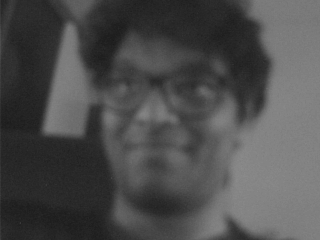
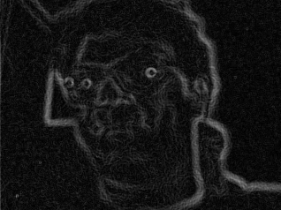

# Arty A7 real-time vision accelerator

This personal research project implements an end-to-end computer-vision system
on a Digilent Arty A7-100T. An OV7670 camera is controlled and captured directly
by custom SystemVerilog; the FPGA converts RGB565 to grayscale, computes Sobel
edges, optionally thresholds them, wraps the result in integrity-checked UDP
packets, and streams validated frames to a Streamlit operator console.

The implemented scope includes the camera interface, clock-domain crossings,
pixel pipeline, 32-lane benchmark core, Ethernet MAC-side logic, custom
application protocol, host reassembly, and physical acceptance evidence.

<p align="center">
  
  
</p>

## Accepted result

| Physical measurement | Result |
|---|---:|
| FPGA sustained Sobel frame time | **0.012288 ms** |
| FPGA controlled compute throughput | **81,380 frames/s** |
| Single-thread OpenCV median kernel time | **0.070522 ms** |
| Single-thread OpenCV throughput | **14,180 frames/s** |
| FPGA / OpenCV throughput | **5.739×** |
| Core-time reduction | **82.6%** |
| Combined output CRC | **`0x9e562313` — exact match** |
| Live frames checked | **9,000** |
| Missing / duplicate / reordered / malformed / CRC / sequence errors | **0** |
| Routed setup / hold slack | **+0.030 ns / +0.024 ns** |

The `5.739×` result is a controlled Sobel-kernel comparison: the two sides use
the same deterministic 320×240 inputs and return the same cropped 318×238,
saturated `|Gx| + |Gy|` output. It is not a claim that every vision workload is
5.739× faster on this FPGA.

The live camera path and the benchmark path are intentionally reported
separately:

- **Live:** one physical Sobel lane; the OV7670 sets the qualified 7.5, 15, or
  30 FPS cadence.
- **Benchmark:** 32 independent Sobel lanes at 200 MHz process deterministic
  frames and expose physical counters plus a combined CRC.

Accepted evidence:

- [`docs/m7_benchmark_results.json`](docs/m7_benchmark_results.json)
- [`docs/m7_benchmark_results.csv`](docs/m7_benchmark_results.csv)
- [`docs/milestone7_benchmark_results.md`](docs/milestone7_benchmark_results.md)
- [`docs/milestone7_hardware_validation.md`](docs/milestone7_hardware_validation.md)
- [`docs/milestone7_timing_summary_pass.rpt`](docs/milestone7_timing_summary_pass.rpt)

## System architecture

```text
                         SENSOR / LIVE PATH

 OV7670              Artix-7 capture            200 MHz vision core
 ┌──────────────┐     ┌──────────────────┐      ┌────────────────────┐
 │ SCCB control │────▶│ RGB565 byte pair │─────▶│ grayscale          │
 │ 24 MHz XCLK  │     │ HREF/VSYNC checks│      │ 2 BRAM line buffers│
 │ D[7:0]+sync  │────▶│ PCLK async FIFO  │      │ 3×3 sliding window │
 └──────────────┘     └──────────────────┘      │ parallel Gx + Gy   │
                                               │ saturate / threshold│
                                               └──────────┬─────────┘
                                                          │ 8-bit pixels
                         NETWORK / HOST PATH               ▼
 ┌──────────────────┐   ┌────────────────────┐   ┌────────────────────┐
 │ Streamlit console│◀──│ strict reassembly  │◀──│ 32 KiB stream FIFO │
 │ activity + logs  │   │ shape/order/CRC   │   │ M5CV packetizer    │
 │ evidence export  │   │ Python UDP socket │   │ ARP + IPv4 + UDP   │
 └──────────────────┘   └────────────────────┘   │ MII + Ethernet FCS │
                                                └──────────┬─────────┘
                                                           ▼
                                                    DP83848J PHY / RJ45

                      CONTROLLED BENCHMARK FORK

 deterministic patterns → 32 independent Sobel lanes @ 200 MHz
                        → cycle/pixel/frame counters + combined CRC
```

### What is custom logic

- OV7670 clock generation, SCCB master and reviewed register sequence;
- direct DVP RGB565 capture, geometry/timing monitors and camera clock crossing;
- fixed-point grayscale, BRAM line buffers, sliding windows, Sobel arithmetic,
  saturation and frame-locked threshold mode;
- 32 independent synthetic benchmark lanes, metric snapshots and CRC evidence;
- DP83848J reset/MDIO discovery, 4-bit MII RX/TX, Ethernet frame RX/TX and FCS;
- ARP responder, IPv4 and UDP framing, echo, control ACKs and transmit arbitration;
- bounded camera FIFO behavior, frame discontinuity recovery and packetizer;
- versioned host control, strict datagram/frame validation and Streamlit workflows.

There is no MicroBlaze, Linux, or soft network stack running on the FPGA.

## Why the FPGA is faster here

The OpenCV control is already an optimized C++ operation, not a Python pixel
loop:

```python
cv2.setNumThreads(1)
gx, gy = cv2.spatialGradient(gray, ksize=3)
edge = cv2.add(
    cv2.convertScaleAbs(gx),
    cv2.convertScaleAbs(gy),
)[1:-1, 1:-1]
```

The CPU loads neighborhoods and issues instructions through a general-purpose
execution engine. The FPGA instantiates the algorithm as spatial dataflow:

```text
CPU / OpenCV                          FPGA / SystemVerilog

load neighboring pixels              two image rows stay in BRAM
          ↓                                       ↓
issue gradient work                  shift registers expose 3×3
          ↓                                       ↓
absolute value + add                 Gx and Gy adders exist together
          ↓                                       ↓
crop and return                      saturation/threshold are stages
          ↓                                       ↓
0.070522 ms                           0.012288 ms
████████████████████████████████      ██████  17.42% of CPU time
```

After the pipeline fills, a live lane accepts one pixel per core cycle without
operating-system scheduling. During the controlled test, 32 independent copies
process one frame per lane on the same coordinate schedule. A combined rotated
CRC forces every physical lane to contribute to the accepted result.

## Technology stack

| Layer | Technology | Responsibility |
|---|---|---|
| Sensor | OV7670, direct 8-bit DVP, SCCB | QVGA RGB565 capture at qualified 7.5/15/30 FPS profiles |
| FPGA | Artix-7 `xc7a100tcsg324-1`, SystemVerilog | Camera, vision, metrics, protocol and Ethernet data paths |
| Clocking / CDC | MMCM, ODDR, XPM async FIFO, reset synchronizers | 24 MHz camera, PCLK, 100 MHz system, 200 MHz core and MII domains |
| Vision | Integer grayscale, 3×3 Sobel L1, threshold | Line-rate fixed-point preprocessing |
| Network | DP83848J, MDIO, 4-bit MII, ARP, IPv4, UDP, CRC/FCS | Direct FPGA-to-host transport without a soft CPU |
| Application protocol | `M5CT` control, `M5CV` image frames, M7 status/config | Sessions, modes, profiles, sequencing and integrity evidence |
| Host | Python, sockets, NumPy, OpenCV, psutil, Streamlit | Control, strict reassembly, benchmark, activity decisions and UI |
| Toolchain | AMD Vivado 2026.1, xsim, Tcl | Simulation, synthesis, implementation, timing and programming |
| Verification | Golden models, 12 RTL benches, host unit tests, CRC, physical matrix | Bit-exact and systems-level acceptance |

## Routed implementation

| Resource | Used | Available | Utilization |
|---|---:|---:|---:|
| Slice LUTs | 17,731 | 63,400 | 27.97% |
| Slice registers | 35,303 | 126,800 | 27.84% |
| Block RAM tiles | 47 | 135 | 34.81% |
| DSP48 blocks | 0 | 240 | 0.00% |

The clean M7 route runs the accelerator at 200 MHz with WNS `+0.030 ns`, TNS
`0 ns`, WHS `+0.024 ns`, and THS `0 ns`. The unused DSP fabric is particularly
relevant to a future small quantized CNN, although free resource counts alone
do not guarantee routing or timing closure.

## Hardware and wiring

Required hardware:

- Digilent Arty A7-100T;
- direct-DVP, no-FIFO OV7670 module;
- USB cable for power/JTAG/UART;
- direct Ethernet cable to the validation computer;
- the validated ASIX USB Ethernet adapter, or an equivalently configured NIC.

Power both boards down before changing camera jumpers. The complete electrical
contract, module orientation and unresolved level-shifting caveat are in
[`docs/milestone3_camera_hardware_contract.md`](docs/milestone3_camera_hardware_contract.md).

### Camera to Arty pin map

| Camera | Arty | FPGA pin | RTL | Direction |
|---|---:|---:|---|---|
| `PLK` | `JB1` | `E15` | `cam_pclk` | camera → FPGA |
| `VS` | `JB2` | `E16` | `cam_vsync` | camera → FPGA |
| `HS` | `JB3` | `D15` | `cam_href` | camera → FPGA |
| `XLK` | `JB4` | `C15` | `cam_xclk` | FPGA → camera |
| `SCL` | `JB7` | `J17` | `cam_sio_c` | FPGA → camera |
| `SDA` | `JB8` | `J18` | `cam_sio_d` | bidirectional open drain |
| `RET` | `JB9` | `K15` | `cam_reset_n` | FPGA → camera |
| `PWDN` | `JB10` | `J15` | `cam_pwdn` | FPGA → camera |
| `D0` | `JC1` | `U12` | `cam_d[0]` | camera → FPGA |
| `D1` | `JC2` | `V12` | `cam_d[1]` | camera → FPGA |
| `D2` | `JC3` | `V10` | `cam_d[2]` | camera → FPGA |
| `D3` | `JC4` | `V11` | `cam_d[3]` | camera → FPGA |
| `D4` | `JC7` | `U14` | `cam_d[4]` | camera → FPGA |
| `D5` | `JC8` | `V14` | `cam_d[5]` | camera → FPGA |
| `D6` | `JC9` | `T13` | `cam_d[6]` | camera → FPGA |
| `D7` | `JC10` | `U13` | `cam_d[7]` | camera → FPGA |
| `3.3V` | `JB6` | — | module power | Arty → camera |
| `DGND` | `JB5` | — | common ground | common |

The unbranded camera module's exact I/O rail and level-shifting arrangement are
not authoritative. Short wires and the documented orientation were used for
the accepted bench; a product-safe revision should measure the rails and add
proper translation where required.

### Board controls

Normal console position:

```text
SW0 = 0 for live lens, or 1 for OV7670 color bars
SW1 = 0  allow the host to choose grayscale/Sobel
SW2 = 1  permit camera streaming
SW3 = 0  reserved
```

| Control | Function |
|---|---|
| `BTN0` | Full design reset |
| `BTN1` | Restart camera initialization and PHY discovery |
| `BTN2` | Clear sticky errors and counters |
| `BTN3` | Print one coherent UART status snapshot |
| `LD4` | Heartbeat |
| `LD5` | Camera identified/configured and Ethernet ready |
| `LD6` | Camera packet activity |
| `LD7` | Any combined sticky error; should remain off |

Changing `SW0` is applied only when camera initialization restarts. Use `BTN1`
or a console configuration action after changing it.

## Ethernet and application protocol

Configure the direct Windows adapter once:

```text
Host IPv4:  192.168.10.1/24
Gateway:    blank
FPGA IPv4:  192.168.10.2
FPGA MAC:   02:00:00:00:00:01
UDP echo:   4000
Control:    4001
```

The FPGA brings up the on-board DP83848J over MDIO, receives/transmits 4-bit
MII nibbles, answers ARP, generates IPv4/UDP headers, computes checksums and
Ethernet FCS, and learns the host return identity from a valid control request.

One image datagram is:

```text
Ethernet 14 B | IPv4 20 B | UDP 8 B | M5CV 32 B
| pixel payload ≤1,024 B | Ethernet FCS 4 B
```

The `M5CV` header carries version/mode, first/last/discontinuity flags, frame
sequence, packet index/count, pixel offset, payload length, dimensions and a
payload CRC32. The host rejects inconsistent shape, count, ordering, offsets,
flags, length, CRC or sequence before a frame can appear.

- grayscale: `320×240 = 76,800` bytes in 75 packets;
- Sobel: `318×238 = 75,684` bytes in 74 packets, with a 932-byte tail.

The camera has no backpressure. On FIFO overflow, RTL discards the affected
frame, resumes only at a clean frame boundary and marks the recovered frame as
a discontinuity. The complete contract is in
[`docs/milestone5_camera_ethernet_contract.md`](docs/milestone5_camera_ethernet_contract.md).

## Run the Streamlit console

Install dependencies once:

```powershell
py -3 -m pip install -r scripts/python/requirements-m7.txt
```

Then double-click [`Launch_M7_Dashboard.cmd`](Launch_M7_Dashboard.cmd), or run:

```powershell
.\scripts\run_m7_dashboard.ps1
```

The console has six work areas:

| Area | Purpose |
|---|---|
| **Project** | Immediate system story, physical data path, accepted evidence and exact CPU/FPGA comparison |
| **1 · Setup** | Dependency/NIC checks, verified-bitstream programming, switches, LEDs and health check |
| **2 · Live** | Camera profile/mode control, validated frames, integrity counters and activity events |
| **3 · Benchmark** | Quick shakedown or complete compute/live acceptance runner |
| **Evidence** | Accepted metrics, fairness contract, live matrix and downloadable run artifacts |
| **Architecture** | Technology stack, computation walkthrough, wiring, packet explorer and resource budget |

The board currently needs the verified M7 image programmed before live
operation. Documentation and UI inspection do not require programming it.

### Verified image

```text
artifacts/m7_runs/build/arty_m7_camera_ethernet_top.bit
SHA-256  0fb90997a1765c921955a383959c1cba94410ff54119dac3a46bf799a80689b6
Size     3,826,007 bytes
```

The console's **Program verified bitstream** action uses Vivado 2026.1 in batch
mode and checks that exactly one A7-100T is attached. Do not use an M5/M6 image;
an older protocol can respond to legacy commands without supporting M7 status,
profiles or synthetic metrics.

## Benchmark methodology

Full acceptance performs:

1. five independent OpenCV runs of 1,000 deterministic frames;
2. five physical FPGA runs of 1,000 requested frames through the synthetic
   32-lane core;
3. exact combined output CRC comparison;
4. safe, medium and fast camera sessions;
5. grayscale, reference Sobel and thresholded Sobel in every profile;
6. 1,000 strictly validated live frames in every profile/mode cell.

| Profile | Grayscale | Reference Sobel | Thresholded Sobel | Frames | Errors |
|---|---:|---:|---:|---:|---:|
| safe | 7.5031 FPS | 7.5031 FPS | 7.5031 FPS | 3,000 | 0 |
| medium | 15.0062 FPS | 15.0062 FPS | 15.0062 FPS | 3,000 | 0 |
| fast | 30.0125 FPS | 30.0126 FPS | 30.0146 FPS | 3,000 | 0 |

The deliberate first-frame discontinuity after STOP/START is tracked as an
expected session boundary, not an integrity error. New console-launched runs
are written under `artifacts/m7_runs/YYYYMMDD_HHMMSS/` as JSON, CSV, Markdown
and console logs.

## Future work

Feasibility research, candidate application paths, a PyTorch/quantized-CNN
assessment, implementation risks, and proposed acceptance gates are maintained
separately in [`docs/next_steps.md`](docs/next_steps.md).

## Repository map

```text
rtl/camera/       OV7670 clock, SCCB init, DVP capture, timing and CDC
rtl/conv/         grayscale, line buffers, Sobel, threshold, 32-lane M7 core
rtl/ethernet/     PHY/MDIO, MII, Ethernet RX/TX, ARP, UDP, checksums and FCS
rtl/integration/  control/status, stream FIFO, packetizer and TX scheduler
rtl/top/          milestone tops and final M7 wrapper
sim/models/       behavioral OV7670 and DP83848/MII models
sim/tb/           self-checking subsystem and integration testbenches
scripts/python/   host protocol, stream worker, benchmark, dashboard and tests
scripts/*.tcl     simulation, synthesis, implementation and programming flows
constraints/     camera, Ethernet and M7 clock-domain constraints
docs/             contracts, walkthroughs, reports and accepted evidence
artifacts/        verified bitstream and generated local runs
```

Important entry points:

- [`rtl/top/arty_m7_camera_ethernet_top.sv`](rtl/top/arty_m7_camera_ethernet_top.sv)
- [`rtl/conv/m7_accelerated_pipeline.sv`](rtl/conv/m7_accelerated_pipeline.sv)
- [`scripts/python/m7_dashboard.py`](scripts/python/m7_dashboard.py)
- [`scripts/python/m7_exhibits.py`](scripts/python/m7_exhibits.py)
- [`scripts/python/benchmark_m7.py`](scripts/python/benchmark_m7.py)
- [`scripts/python/m7_protocol.py`](scripts/python/m7_protocol.py)

## Developer verification

```powershell
# Host regressions
py -3 -m unittest discover -s scripts/python -p "test_*.py"

# M7 RTL testbenches
& "C:\AMDDesignTools\2026.1\Vivado\bin\vivado.bat" `
  -mode batch -source scripts/run_m7_simulations.tcl

# Synthesis check
& "C:\AMDDesignTools\2026.1\Vivado\bin\vivado.bat" `
  -mode batch -source scripts/check_m7_synthesis.tcl

# Routed implementation and bitstream
& "C:\AMDDesignTools\2026.1\Vivado\bin\vivado.bat" `
  -mode batch -source scripts/build_m7_bitstream.tcl
```

After any RTL or constraint change, do not reuse the accepted performance
claim automatically. Re-run host/RTL tests, timing/CDC/DRC review, bitstream
hashing, setup check, profile qualification and the complete physical
benchmark.
