# Arty A7 vision accelerator: technical design

This is the authoritative design reference for the final M7 implementation. It
describes the implemented RTL contract, not a future architecture. Historical
milestone documents explain how the design evolved; when they differ from this
document, this document and the M7 source take precedence.

| Item | Final value |
|---|---|
| Top module | `rtl/top/arty_m7_camera_ethernet_top.sv` |
| Integrated implementation | `rtl/top/arty_m5_camera_ethernet_top.sv` with `M7_ENABLE=1` |
| Target | Digilent Arty A7-100T, `xc7a100tcsg324-1` |
| Build ID | `0x4d370001` |
| Input | OV7670 QVGA RGB565, 320x240 |
| Outputs | Grayscale 320x240; Sobel/threshold 318x238 |
| Host control endpoint | `192.168.10.2:4001` |
| UDP echo endpoint | `192.168.10.2:4000` |
| Toolchain used for acceptance | AMD Vivado 2026.1 |

## 1. Design intent and invariants

The design moves a camera frame through capture, fixed-point image processing,
packetization, Ethernet, and strict host reassembly without a soft CPU. The
implementation is built around these invariants:

1. A valid pixel always carries its raster coordinate. Gaps are allowed; order
   changes are not.
2. Algorithm configuration is locked at a frame boundary. A frame cannot mix
   threshold settings or output modes.
3. Clock-domain crossings use asynchronous FIFOs, single-bit synchronizers, or
   request/acknowledge snapshot protocols. Multi-bit status is not sampled as a
   free-running asynchronous bus.
4. The camera cannot be backpressured. Every bounded queue therefore has an
   explicit overflow indication, and the network stream has a frame recovery
   policy.
5. A packet is not eligible for transmit until its complete payload and payload
   CRC are stored.
6. The host exposes only structurally valid, complete frames. Reordering,
   sequence gaps, and intentional discontinuities are counted separately so an
   acceptance run can require all unexpected continuity counters to be zero.
7. Live-camera rate and synthetic compute throughput are separate measurements.

Non-goals are a general-purpose MAC, IP fragmentation/reassembly, TCP, dynamic
addressing, arbitrary image sizes at run time, or a general convolution ISA.

## 2. Top-level architecture

```mermaid
flowchart LR
    subgraph Camera[Camera side]
      XCLK[24 MHz XCLK + reset] --> OV[OV7670]
      SCCB[SCCB init/profile control] --> OV
      OV -->|D7:0, HREF, VSYNC, PCLK| DVP[DVP RGB565 capture]
      DVP --> CFIFO[1 Ki-entry camera async FIFO]
    end

    subgraph System[100 MHz system domain]
      CFIFO --> GRAY[RGB565 luminance]
      GRAY --> IFIFO[core input async FIFO]
      OFIFO[core output async FIFO] --> THR[frame-locked threshold]
      GRAY --> MUX{session mode}
      THR --> MUX
      MUX --> SFIFO[32 Ki-entry stream async FIFO]
    end

    subgraph Core[200 MHz core domain]
      IFIFO --> LB[two-row line storage]
      LB --> WIN[3x3 window]
      WIN --> SOBEL[four-stage Sobel]
      SOBEL --> OFIFO
      SYN[deterministic generator] --> LANES[32 physical Sobel lanes]
      LANES --> METRICS[counters + combined CRC]
    end

    subgraph Ethernet[25 MHz PHY domains]
      SFIFO --> PKT[M5CV packetizer]
      RX[MII RX + frame parser] --> CTRL[M5CT / ARP / echo]
      PKT --> ARB[non-preemptive TX arbiter]
      CTRL --> ARB
      ARB --> FRAME[IPv4/UDP frame + FCS]
      FRAME --> TXFIFO[TX async FIFO]
      TXFIFO --> MII[MII low/high nibbles]
    end

    METRICS -. coherent status snapshot .-> CTRL
    MII --> PHY[DP83848J PHY]
    PHY --> RX
    PHY <--> HOST[Python validation + Streamlit]
```



### 2.1 Module ownership

| Function | Primary source |
|---|---|
| Final pin-compatible wrapper | `rtl/top/arty_m7_camera_ethernet_top.sv` |
| Integrated camera/vision/network system | `rtl/top/arty_m5_camera_ethernet_top.sv` |
| Camera XCLK and startup | `rtl/camera/camera_xclk.sv` |
| SCCB transaction and register program | `rtl/camera/sccb_master.sv`, `camera_register_init.sv` |
| DVP byte capture and geometry checks | `rtl/camera/dvp_rgb565_capture.sv` |
| Camera CDC and luminance conversion | `camera_stream_cdc.sv`, `camera_stream_adapter.sv` |
| M7 clock bridge and benchmark lanes | `rtl/conv/m7_accelerated_pipeline.sv` |
| Line storage and 3x3 window | `line_buffer_3x3.sv`, `window_3x3.sv` |
| Sobel and threshold | `sobel3x3.sv`, `saturate_u8.sv`, `m7_threshold_sobel.sv` |
| Stream CDC and recovery | `rtl/integration/m5_stream_fifo.sv` |
| Video packetization | `rtl/integration/m5_stream_packetizer.sv` |
| Control/status | `m7_control_receiver.sv`, `m7_control_ack.sv`, `m5_status_snapshot.sv` |
| Ethernet/MII | `rtl/ethernet/` |
| Host protocol and reassembly | `scripts/python/m7_protocol.py`, `m6_stream_client.py` |
| Benchmark and accepted schema | `benchmark_m7.py`, `m7_results.py` |

## 3. Clocks, resets, and CDC

### 3.1 Clock domains

| Domain | Nominal rate | Source | Responsibilities |
|---|---:|---|---|
| `clk_100mhz` | 100 MHz | Arty oscillator | SCCB, camera configuration, grayscale, threshold, control synchronization, UART, MDIO control |
| Internal camera XCLK | 24 MHz | MMCM from 100 MHz | Drives an ODDR that forwards `cam_xclk`; not the capture clock |
| `cam_pclk` | up to the constrained 24 MHz | OV7670 input | DVP byte pairing, camera geometry, camera FIFO write |
| `core_clk` | 200 MHz | M7 MMCM from 100 MHz | Live Sobel, 32-lane synthetic Sobel, core counters and CRCs |
| Internal Ethernet reference | 25 MHz | MMCM from 100 MHz | ODDR-forwarded `eth_ref_clk` for the DP83848J |
| `eth_rx_clk` | 25 MHz at 100BASE-TX | DP83848J input | MII receive, frame parsing, sessions, packetization, transmit scheduling and frame encoding |
| `eth_tx_clk` | 25 MHz at 100BASE-TX | DP83848J input | MII transmit nibble timing |

SCCB, MDC, and UART baud rates are clock-enable/counter behavior inside the
100 MHz domain; they are not independent internal clock domains.

### 3.2 Crossing inventory

| Crossing | Mechanism | Payload / rule |
|---|---|---|
| `cam_pclk` -> 100 MHz | Xilinx `xpm_fifo_async`, FWFT | `{frame_start, frame_end, line_end, x, y, rgb565}` |
| 100 MHz -> 200 MHz | Xilinx `xpm_fifo_async`, FWFT | `{x, y, gray}` |
| 200 MHz -> 100 MHz | Xilinx `xpm_fifo_async`, FWFT | `{x, y, sobel}` |
| 100 MHz -> `eth_rx_clk` | Xilinx `xpm_fifo_async`, FWFT | `{discontinuity, frame_start, frame_end, stream_id, pixel}` |
| `eth_rx_clk` -> `eth_tx_clk` | Gray-pointer dual-clock FIFO | `{last, encoded_byte}` |
| Status buses -> 100 MHz | Toggle request/acknowledge snapshot | Source latches and holds the complete bus until destination capture |
| Control configuration -> 100 MHz | Stable data plus synchronized toggle | Data is written before the event toggle and sampled after synchronization |
| Single flags / sticky errors | Two- or three-flop `ASYNC_REG` chain | Level or registered sticky source; pulses are converted to levels/toggles first |

The timing constraints declare the system, camera, core, RX, and TX clocks
asynchronous where appropriate. The CDC report still recognizes structural
patterns imperfectly; every accepted warning is classified in
`docs/milestone7_cdc_drc_classification.md`.

### 3.3 Reset contract

`BTN0` is the asynchronous system reset source. `reset_sync` asserts reset
asynchronously and releases it through two flip-flops in each receiving domain.
The camera XCLK, core, RX, and TX domains also stay reset until their required
clock/PHY ready condition is true.

Asynchronous FIFO reset discards queued data. Memory arrays are not cleared;
their contents are invalid until fresh valid records are written. A reset or
link loss invalidates the active stream session, so stale FIFO contents cannot
be presented as a continued host frame.

## 4. Streaming contracts

There are three related but distinct handshakes.

### 4.1 Valid-only pixel streams

The camera, grayscale, window, and Sobel interfaces use `valid` without
`ready`:

- a transfer occurs on a rising clock edge when `valid=1`;
- `pixel`, `x`, `y`, and any frame/line marker belong to that transfer;
- `valid=0` is an arbitrary gap and payload values are ignored;
- coordinates must remain raster ordered: x increments from 0 to width-1,
  then y increments;
- because no `ready` exists, downstream storage must accept the transfer or
  set an overflow/error flag.

This contract matches a free-running camera. Backpressure is introduced only
after pixels enter a bounded FIFO.

### 4.2 FWFT FIFO streams

First-word-fall-through FIFOs expose the current head record whenever
`read_valid=1`. A record is consumed only when both `read_valid` and the
consumer's `read_enable` are true. The stream FIFO implements this explicitly
as `rd_en = read_enable && read_valid`.

The camera and M7 core bridge FIFOs are intentionally drained whenever data is
available because the receiving pipelines accept one record per clock. The
network stream FIFO is demand-driven by the packetizer and stops while a full
packet waits for transmission.

### 4.3 Ethernet byte stream

`ethernet_frame_tx` uses `output_valid` / `output_ready`. State and CRC advance
only on `output_valid && output_ready`. The byte stream crosses to the PHY TX
clock through a FIFO; `mii_tx.byte_ready` consumes one byte and emits its low
nibble followed by its high nibble.

`packet_ready` is a descriptor-level handshake. The packetizer holds the
complete packet image and metadata stable until the scheduler grants the
camera source and `frame_tx_done` produces `packet_done`.

## 5. Camera front end

### 5.1 Startup and configuration

`camera_xclk` creates 24 MHz with an MMCM, buffers it, and forwards it through
an ODDR. The module holds `PWDN` high and `RESET_N` low until the MMCM is locked
and the startup counter completes. A rising ready condition starts the SCCB
register program.

The SCCB master is open-drain on SDA. `camera_register_init` writes the selected
safe/medium/fast profile, optionally enables the OV7670 color bars, reads the
product/version IDs, and reads back timing registers. Changing `SW0` takes
effect only after camera initialization restarts.

### 5.2 DVP capture

The final configuration treats VSYNC high as frame blanking and HREF high as
active line data. `dvp_rgb565_capture` waits until at least one VSYNC has been
seen, then:

1. latches the first byte of a pixel;
2. combines the next byte as `{first_byte, second_byte}` (`byte_swap=0`);
3. emits one RGB565 transfer with `(x,y)`;
4. asserts `frame_start` on `(0,0)`, `line_end` on `x=319`, and `frame_end` on
   `(319,239)`.

It flags odd byte counts, wrong pixels per line, wrong lines per frame, and
pixels outside the configured geometry. The camera timing monitor separately
records frame period, raw PCLK edges, active bytes, line period, and active
line count for status/qualification.

### 5.3 Grayscale conversion

The camera CDC carries complete RGB565 records into 100 MHz. The one-stage
grayscale block expands color components by MSB replication and computes:

```text
R8 = {R5, R5[4:2]}
G8 = {G6, G6[5:4]}
B8 = {B5, B5[4:2]}

gray = (77*R8 + 150*G8 + 29*B8 + 128) >> 8
```

This is integer rounded luminance with coefficients summing to 256. The stream
adapter delays coordinates and frame markers by the same register stage.

## 6. Sobel pipeline

### 6.1 Stage structure

The live M7 path crosses grayscale pixels to 200 MHz, runs one
`conv_pipeline_top`, and crosses its output back to 100 MHz. The local core
pipeline is:

| Stage | Registers | Operation |
|---|---:|---|
| Line storage | 2 | Synchronous read of both row banks, then align current/y-1/y-2 pixels |
| Window | 1 | Shift the three row taps horizontally and emit a valid 3x3 neighborhood |
| Sobel A | 1 | Sum positive and negative terms for Gx and Gy |
| Sobel B | 1 | Subtract term groups into signed 12-bit gradients |
| Sobel C | 1 | Compute `abs(Gx) + abs(Gy)` in 11 bits |
| Sobel D | 1 | Saturate to 8 bits and align coordinates |
| Threshold/bypass | 1 at 100 MHz | Optional binary threshold after the core CDC |

Once full, the live core accepts one valid grayscale pixel per 200 MHz cycle
and can emit one valid Sobel pixel per cycle. Frame blanking and FIFO crossings
can introduce gaps but do not change ordering.

### 6.2 Line-buffer architecture

Each Sobel lane contains two logical `IMAGE_WIDTH x 8` block-RAM row banks.
Even input rows write the even bank; odd rows write the odd bank. Both banks are
read synchronously at the current x before the selected bank is overwritten.

For input row `y`:

- the current input register supplies row `y`;
- the opposite-parity bank contains row `y-1`;
- the same-parity bank's pre-write read value contains row `y-2`.

This ping-pong scheme retains only two previous image rows rather than a full
frame. The memories are deliberately not reset. Their data is ignored until
coordinates prove that two complete prior rows and two prior columns exist.

`window_3x3` holds two horizontal delays for each of the three row taps. At
`x=0` it clears horizontal history so pixels never leak across line boundaries.
It asserts `window_valid` only for `x>=2 && y>=2`, and labels the window with
its center coordinate `(x-1,y-1)`. Therefore:

```text
Input coordinates:   x = 0..319, y = 0..239
Output coordinates:  x = 1..318, y = 1..238
Output raster size:  318 x 238 = 75,684 pixels
Border policy:       discard one pixel on every side
```

### 6.3 Sobel arithmetic

With `p00` at the top-left and `p22` at the bottom-right:

```text
Gx = (p02 + 2*p12 + p22) - (p00 + 2*p10 + p20)
Gy = (p20 + 2*p21 + p22) - (p00 + 2*p01 + p02)
M  = min(255, abs(Gx) + abs(Gy))
```

The center pixel `p11` is mathematically unused. Positive and negative term
groups are 11-bit unsigned values, gradients are 12-bit signed values, and the
L1 magnitude is 11 bits with a maximum of 2,040. `saturate_u8` clamps any
nonzero upper magnitude bits to `0xff`.

### 6.4 Threshold mode

`m7_threshold_sobel` either passes the saturated Sobel byte unchanged or emits
`0xff` when `sobel >= threshold` and `0x00` otherwise. Requested enable and
threshold values are sampled on the first cropped pixel `(1,1)` and then held
for the frame. The first pixel is evaluated with the newly sampled settings,
so there is no one-pixel configuration lag.

## 7. M7 synthetic benchmark core

The physical benchmark is a separate use of the processing fabric, not the
camera's measured frame rate.

- Lane 0 is the live Sobel pipeline.
- Lanes 1-31 are additional physical `conv_pipeline_top` instances used only
  while a synthetic run owns the core.
- All lanes receive the same coordinate schedule. The base pixel is
  `(3*x + 5*y + ((x ^ y) & 0x1f)) mod 256`; lane `n` XORs it with
  `((n * 0x1d) & 0xff)`.
- One 320x240 coordinate sweep therefore computes 32 distinct frames in
  76,800 core cycles.
- Each lane computes a full output CRC. The reported proof value is
  `xor(rotate_left(lane_crc[n], n))` over all 32 lanes, combined through a
  two-level XOR tree.

Synthetic ownership blocks new live pixels and pauses reads from the live input
FIFO. Synthetic outputs do not enter the live output FIFO. Live admission
resumes only when the benchmark has drained and a new `(0,0)` input marks a
clean frame boundary.

For the accepted 1,000-frame run, 32 coordinate sweeps execute 1,024 lane
frames. All executed work in the partial final batch is charged against the
1,000 requested frames:

```text
effective cycles/frame = ceil(1000/32) * 76,800 / 1000 = 2,457.6
effective frame time   = 2,457.6 / 200 MHz = 0.012288 ms
effective throughput   = 81,380.208 frames/s
```

Core metrics also expose first-input-to-last-output latency, raw frame-start
interval, accepted/produced pixels, valid-gap cycles, completed frames, and
the combined CRC through coherent status snapshots.

## 8. Stream selection and buffering

At the start of every grayscale frame, the 100 MHz domain locks the requested
stream ID:

- stream 1: grayscale, 320x240;
- stream 0: reference or thresholded Sobel, 318x238.

`SW1` can force grayscale. `SW2`, an active learned host session, and an
incomplete requested frame count are all required before pixels enter the
network stream FIFO.

The FIFO record is 12 bits:

```text
bit 11      discontinuity
bit 10      frame_start
bit 9       frame_end
bit 8       stream_id (0 Sobel, 1 grayscale)
bits 7:0    pixel
```

The default depth is 32,768 records. This absorbs Ethernet/control arbitration
but is smaller than a full QVGA frame, so the overflow policy is part of the
functional contract.

## 9. Ethernet and application protocol

### 9.1 Fixed network identity

| Endpoint | Value |
|---|---|
| FPGA MAC | `02:00:00:00:00:01` |
| FPGA IPv4 | `192.168.10.2` |
| Host IPv4 | `192.168.10.1/24` |
| UDP echo | port 4000 |
| Control, status, and video source | port 4001 |

A valid control request teaches the FPGA the host MAC, IPv4 address, and UDP
source port. Reset, link loss, STOP, or a new START restarts session state.

### 9.2 Receive and transmit paths

`mii_rx` reconstructs a byte from the PHY's low nibble followed by high nibble.
`ethernet_frame_rx` finds the SFD, stores the frame, verifies the Ethernet FCS,
checks minimum/maximum length and MII error conditions, and parses the fixed
ARP/IPv4/UDP header locations. IPv4 control/echo requests also require a valid
20-byte IPv4 header checksum and consistent IP/UDP lengths.

Transmit scheduling is non-preemptive. Priority is:

1. ARP reply;
2. control/status acknowledgement;
3. UDP echo;
4. camera video packet;
5. reserved test source.

Once selected, a source owns the encoder until the complete Ethernet frame is
done. `ethernet_frame_tx` adds seven preamble bytes, the SFD, minimum-frame
padding when needed, and a four-byte Ethernet FCS. The video packetizer's
`frame_length` covers destination MAC through the final application payload;
preamble/SFD/FCS are added by the encoder.

### 9.3 M5CT control message

All requests and acknowledgements use a 12-byte big-endian UDP payload:

| Byte | Size | Field |
|---:|---:|---|
| 0 | 4 | ASCII `M5CT` |
| 4 | 1 | Version: 1 or 2 |
| 5 | 1 | Opcode |
| 6 | 1 | Stream ID: 0 Sobel, 1 grayscale |
| 7 | 1 | Request flags (must be zero); v2 ACK status |
| 8 | 4 | Big-endian value |

| Opcode | Version | Meaning of value |
|---:|---:|---|
| 1 START | 1, 2 | Requested frame count; zero is continuous |
| 2 STOP | 1, 2 | Zero |
| 3 PING/STATUS | 1 / 2 | v1 ping value / v2 status page number |
| 4 CONFIGURE | 2 | Profile in bits 25:24, threshold enable in bit 16, threshold in bits 15:8 |
| 5 SYNTHETIC | 2 | Benchmark frame count, 1..65,535 |

An ACK sets opcode bit 7 and echoes the accepted stream/value. V2 status is 0
for success, 1 when a configuration/benchmark request conflicts with an active
stream, 2 for invalid fields, and 3 for an unimplemented status page. CONFIGURE
and SYNTHETIC are accepted only while no stream session is active.

V2 status pages are:

| Page | Value |
|---:|---|
| 0 | Build ID |
| 1 | Link/camera/core/config flags, active threshold, combined error bits |
| 2 | Camera frame period in 100 MHz cycles |
| 3 | Camera PCLK edges per frame |
| 4 | Camera active bytes per frame |
| 5 | Active lines (upper 16), PCLK edges per line (lower 16) |
| 6 | Camera FIFO peak (upper 16), stream FIFO peak (lower 16) |
| 7 | Core latency cycles |
| 8 | Core frame interval cycles |
| 9 | Core accepted pixels |
| 10 | Core produced pixels |
| 11 | Core valid-gap cycles |
| 12 | Core completed frames |
| 13-14 | Camera timing-register readback |
| 15 | Combined error flags |
| 16 | Synthetic busy bit and completed-frame count |
| 17 | Core/combined output CRC32 |

### 9.4 M5CV video datagram

Each video UDP payload is a 32-byte big-endian application header followed by
1-1,024 raster bytes. IPv4 fragmentation is never used.

| Byte | Size | Field |
|---:|---:|---|
| 0 | 4 | ASCII `M5CV` |
| 4 | 1 | Version `1` |
| 5 | 1 | Stream ID |
| 6 | 1 | Bit 0 FIRST, bit 1 LAST, bit 2 DISCONTINUITY |
| 7 | 1 | Header size `32` |
| 8 | 4 | Frame sequence |
| 12 | 2 | Packet index |
| 14 | 2 | Total packet count |
| 16 | 4 | Pixel offset in the output raster |
| 20 | 2 | Pixel payload length |
| 22 | 2 | Output width |
| 24 | 2 | Output height |
| 26 | 2 | Reserved, zero |
| 28 | 4 | CRC32 of this datagram's pixel payload |

Packet counts are fixed by the selected stream:

| Stream | Bytes/frame | Packets/frame | Tail |
|---|---:|---:|---:|
| Sobel/threshold, 318x238 | 75,684 | 74 | 932 bytes |
| Grayscale, 320x240 | 76,800 | 75 | 1,024 bytes |

The complete maximum video frame presented to the Ethernet encoder is:

```text
Ethernet header 14
+ IPv4 header   20
+ UDP header     8
+ M5CV header   32
+ pixels      <=1024
=              <=1098 bytes before Ethernet FCS
```

The IPv4 header uses version/IHL `0x45`, don't-fragment, TTL 64, protocol 17,
and a computed IPv4 checksum. The IP identification is the low 16 bits of the
frame sequence XOR packet index. The UDP checksum field is zero. Payload CRC32
and Ethernet FCS are separate integrity layers and both use the reflected
`0xedb88320` polynomial with standard initialization/final complement.

## 10. Overflow and frame recovery

The design distinguishes transport recovery from lower-level diagnostic
overflow.

### 10.1 Camera CDC FIFO

The 1,024-entry camera FIFO cannot backpressure the OV7670. A write while full
or while FIFO reset is busy sets `camera_fifo_overflow` and increments dropped
pixels. This FIFO does not invent replacement coordinates or replay the frame.
Any occurrence invalidates the affected image and the accepted run; the
operator should stop/restart or reset after investigating the camera/system
rate relationship.

### 10.2 M7 input/output FIFOs

The 100-to-200 MHz input and 200-to-100 MHz output FIFOs have sticky overflow
flags. Live input is accepted only when the input FIFO is available. Synthetic
output is intentionally discarded before the output FIFO. An overflow is a
design-health failure and is surfaced in combined error bit 13; there is no
silent retry.

### 10.3 Network stream FIFO

This FIFO has frame-aware recovery:

1. On the first blocked write, set the sticky overflow flag, increment dropped
   frame/pixel counters, and mark discontinuity pending.
2. Suppress the rest of the affected frame.
3. Continue dropping until a `frame_start` record can be written.
4. Write that clean first record with `DISCONTINUITY=1` and resume normally.

Disabling a stream mid-frame also arms discontinuity for the next clean frame.
The recovered frame is structurally complete; the flag tells the host that a
session/frame boundary was crossed.

### 10.4 Packetizer

The packetizer will not mix stream IDs or cross a frame boundary. It checks the
position of `frame_end` against the expected byte count. An unexpected new
`frame_start`, stream change, premature/missing end, or one-pixel frame aborts
the current packet/frame, increments `packet_errors`, and waits for another
matching clean frame start.

While `packet_ready=1`, FIFO reads stop until `packet_done`. When the requested
frame count is reached, `stream_complete` stops further capture for the session.

### 10.5 Host recovery

The host rejects malformed headers, unsupported stream/shape, wrong packet
count, impossible lengths/offsets, invalid FIRST/LAST flags, duplicate packets,
payload CRC mismatches, and inconsistent frame metadata. It counts out-of-order
packets and frame-sequence gaps. Only a complete frame with every expected
packet is returned to the UI.

`DISCONTINUITY` is tracked separately from integrity errors. One discontinuity
on the first clean frame after an intentional STOP/START is expected; missing,
duplicate, malformed, CRC, and sequence errors must remain zero.

## 11. Error and status behavior

The top-level combined error vector drives `LD7` and status pages:

| Bit | Meaning |
|---:|---|
| 0 | Camera init/SCCB error |
| 1 | Camera ID mismatch after initialization |
| 2 | DVP capture or coordinate error |
| 3 | Camera CDC FIFO overflow |
| 4-7 | PHY bring-up error flags |
| 8 | Network stream FIFO overflow |
| 9 | Packetizer or control error count nonzero |
| 10 | Bad/runt/oversize/RX/protocol Ethernet frame count nonzero |
| 11 | TX length error or TX FIFO overflow |
| 12 | TX FIFO underflow or MII underrun |
| 13 | Vision pipeline input/output overflow |
| 14 | Ethernet collision observed |
| 15 | M7 200 MHz core MMCM not locked |

Counters and sticky flags clear through `BTN2` where implemented. Reset is the
only operation that unconditionally reinitializes all domains and session
state.

## 12. Board interface

### 12.1 Camera wiring used for acceptance

| Camera | Arty | FPGA pin | RTL direction |
|---|---:|---:|---|
| `PLK` | `JB1` | `E15` | camera -> FPGA |
| `VS` | `JB2` | `E16` | camera -> FPGA |
| `HS` | `JB3` | `D15` | camera -> FPGA |
| `XLK` | `JB4` | `C15` | FPGA -> camera |
| `SCL` | `JB7` | `J17` | FPGA -> camera |
| `SDA` | `JB8` | `J18` | bidirectional open drain |
| `RET` | `JB9` | `K15` | FPGA -> camera |
| `PWDN` | `JB10` | `J15` | FPGA -> camera |
| `D0..D3` | `JC1..JC4` | `U12,V12,V10,V11` | camera -> FPGA |
| `D4..D7` | `JC7..JC10` | `U14,V14,T13,U13` | camera -> FPGA |
| `3.3V` | `JB6` | - | Arty -> camera |
| `DGND` | `JB5` | - | common |

Power both boards down before changing wiring. The unbranded module's exact I/O
rail/level-shifting implementation is not authoritative; the complete safety
and orientation notes are in `docs/milestone3_camera_hardware_contract.md`.

### 12.2 Controls and LEDs

| Control | Function |
|---|---|
| `SW0` | Live lens / OV7670 color bars on next camera initialization |
| `SW1` | Force grayscale when high |
| `SW2` | Permit network streaming when high |
| `SW3` | Reserved; keep low |
| `BTN0` | Full reset |
| `BTN1` | Restart camera initialization and PHY discovery |
| `BTN2` | Clear sticky errors/counters |
| `BTN3` | Print coherent UART status |
| `LD4` | Heartbeat |
| `LD5` | Camera ID/config and Ethernet link ready |
| `LD6` | Camera packet/transmit activity |
| `LD7` | Any combined sticky error |

## 13. Verification and acceptance

Verification is layered so a matching screenshot cannot hide an arithmetic,
transport, or timing defect.

| Layer | Method | Acceptance |
|---|---|---|
| Unit RTL | Self-checking grayscale, line/window, Sobel, threshold, CRC, UART, SCCB, MDIO, MII benches | Every bench prints PASS |
| Integration RTL | Camera pipeline, M5 control/packetizer/TX scheduling, M7 core/control/status | Twelve M7 regression benches pass |
| Host | `unittest` for protocol, algorithms, activity, schemas, client behavior | 13 tests pass |
| Algorithm equivalence | Python/OpenCV golden output vs physical 32-lane CRC | Exact `0x9e562313` match |
| Physical compute | Five 1,000-frame OpenCV runs and five 1,000-frame FPGA requests | Ratio >=1.05; accepted 5.7391x |
| Live transport | 3 profiles x 3 modes x 1,000 frames | 9,000 frames; zero integrity errors |
| Implementation | Vivado route, timing, CDC, DRC review | WNS/WHS positive; zero DRC errors; warnings classified |

The controlled comparison uses identical deterministic inputs and a matching
318x238 saturated L1 Sobel. OpenCV is forced to one thread and timed only around
the kernel. FPGA time comes from physical core counters. Camera, UDP, UI, and
disk time are excluded from both compute timings and reported separately.

Accepted evidence:

- `docs/m7_benchmark_results.json` and `.csv`: machine-readable physical runs;
- `docs/milestone7_benchmark_results.md`: readable performance summary;
- `docs/milestone7_hardware_validation.md`: physical acceptance matrix;
- `docs/milestone7_timing_summary_pass.rpt`: final routed timing;
- `docs/milestone7_cdc_drc_classification.md`: structural warning review.

After any functional RTL or constraint change, the old bitstream hash, route,
physical benchmark, and performance claim are stale until the full acceptance
sequence is repeated.

## 14. Known constraints and extension points

- Image dimensions are synthesis-time parameters. Packet counts and host shape
  checks assume the final 320x240 / 318x238 configuration.
- Outbound UDP checksum is zero; Ethernet FCS, IPv4 checksum, and application
  payload CRC remain active.
- DVP input delays are intentionally not guessed. Productization requires
  measured sensor/cable skew and explicit input timing.
- The benchmark proves this Sobel mapping, not arbitrary computer-vision speed.
- DSP48 resources are unused. A CNN or other multiply-heavy extension would
  require a new memory, routing, timing, golden-model, and physical acceptance
  plan rather than being inferred from free DSP count.
- Historical M1-M5 tops and their benches are retained for regression and
  subsystem fault isolation; generated Vivado project products are not source
  and should be recreated from `scripts/*.tcl`.
